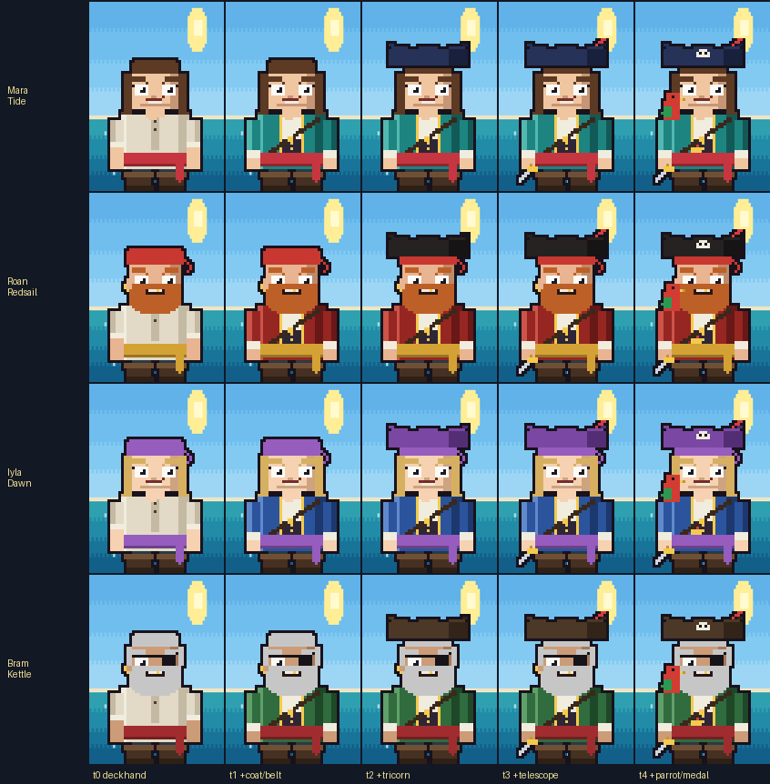
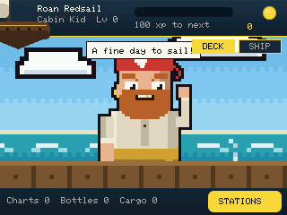
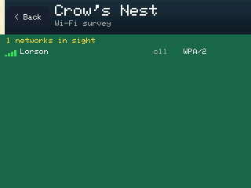
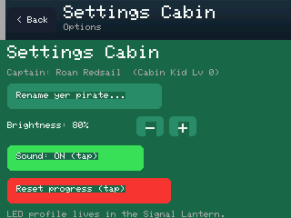

# 🏴‍☠️ Pocket-Pirate-CYD


A pirate-themed handheld utility and firmware suite built specifically for the ESP32-S3 2.8" TFT Touch Module (commonly known as the **Cheap Black Display** or **CYD**). Transform your pocket hardware into a fully functional pirate captain's dashboard complete with pixel art, interactive menus, and modular tools!


---

## ⚓ Features & Modules

Pocket-Pirate-CYD comes packed with custom assets and modular features designed for the ESP32-S3 architecture:

* **🏴‍☠️ Pirate Status Dashboard:**
  * Tracks your current rank (e.g., *Redbeard - Deckhand Lv 2*), experience progress bars, charts, cargo metrics, and pillaged "bottles".
  * Interactive touch tabs (`DECK` / `SHIP` / `STATIONS`) to navigate between different operational screens.
* **🎨 Artpack Pixel & Sample Engines:**
  * Modular graphics asset packs (`artpack_pixel` and `artpack_sample`) providing custom retro UI layouts, status icons, and background rendering.
* **🛠️ Utility & Tool Suite:**
  * Built-in helper scripts and tools located in the `tools/` directory to assist with asset conversion, flashing workflows, and system debugging.
* **📦 Modular Firmware Layout:**
  * Cleanly structured codebase utilizing PlatformIO for seamless expansion, custom hardware hooks, and easy deployment.
* **📡 Passive stations (metadata only):** Crow's Nest Wi-Fi survey (sort/filter/detail), Lookout channel histogram, Chart Room WiGLE CSV logger — **no deauth / injection / handshake capture**.
* **🧭 Optional UART GPS:** Chart Room + Instruments show fix status; WiGLE rows get real lat/lon/alt/UTC when a fix is available (`docs/GPS.md`).
* **🔋 Power UX:** CHG/FULL/%/LOW labels, dim-on-idle, optional idle deep-sleep + Settings **Sleep now** (touch wake).
* **📜 Captain's Log:** SD browser with text/CSV preview and on-device WiGLE viewer.
* **🔭 Spyglass:** DeFlock / @NitekryDPaul field OUIs (detect-only) + keyword heuristics.
* **🛰️ OTA:** Settings Cabin update-from-URL (app image); configure via companion (`docs/OTA.md`).
* **🖥️ USB companion:** Line/JSON protocol + WiGLE `summarize` / `export` helpers (`docs/COMPANION.md`).
* **⚙️ CI / releases:** Workflow templates publish **merged 0x0** factory bins (+ app-only for OTA).

---

## 🚀 Getting Started & Startup Process

### Prerequisites
1. **Visual Studio Code** installed on your workstation.
2. The **PlatformIO IDE** extension installed inside VS Code.
3. A USB-C cable connected to your ESP32-S3 CYD board.
4. For the serial device test helper: Python 3, then `pip install -r tools/requirements.txt` (`pyserial`, `Pillow`).

### Installation & Flashing

1. **Clone the repository:**

   ```bash
   git clone https://github.com/Evil0ctopus/Pocket-Pirate-CYD.git
   cd Pocket-Pirate-CYD
   ```

2. **Open the project workspace:**
   Launch VS Code and open the cloned `Pocket-Pirate-CYD` folder. PlatformIO will automatically recognize the `platformio.ini` configuration.

3. **Connect your hardware:**
   Plug your ESP32-S3 CYD device into your computer via USB. (Put the device into bootloader mode if required by holding the BOOT button while connecting.)

4. **Build and Upload:**
   Click the PlatformIO: Upload button (the right-pointing arrow icon in the bottom status bar) or run:

   ```bash
   pio run --target upload
   ```

5. **Launch:**
   Once the upload completes, the device will automatically reboot, execute the boot sequence, and present your pirate captain dashboard on the touch display!

### Serial device test helper

`tools/device_test.py` drives the firmware's USB serial test hooks (`INFO` / `TAP` / `SHOT`) and writes PNGs under `device_shots/`.

Install deps once:

```bash
pip install -r tools/requirements.txt
```

There is **no hardcoded COM port**. Pass `--port`, or omit it to auto-detect when exactly one USB serial port is present. If multiple USB serial devices are connected, `--port` is required:

```bash
# Windows example
python tools/device_test.py --port COM3

# Linux example
python tools/device_test.py --port /dev/ttyACM0

# macOS example
python tools/device_test.py --port /dev/cu.usbmodem14101

# Auto-detect (succeeds only if exactly one port is available)
python tools/device_test.py
```

If no USB serial ports are found, or several are present, the script exits with a clear error (listing any non-USB ports it skipped) and the `--port` usage.

---

## 💾 Flash a release binary

Release asset `Pocket-Pirate-CYD-cheap-black-display.bin` is a **merged factory
image** (bootloader + partition table + app). Write it at **offset 0x0**.
Do **not** flash the app-only `firmware.bin` / `…-app.bin` at 0x0.

```bash
# From source (recommended)
pio run -e cheap-black-display -t upload

# Or package locally then esptool (discover your port — COM numbers change)
pio run -e cheap-black-display
python tools/package_firmware.py
esptool.py --chip esp32s3 --port PORT write_flash 0x0 \
  dist/Pocket-Pirate-CYD-cheap-black-display.bin
```

The `…-app.bin` asset (when published) is for **OTA only** — see [`docs/OTA.md`](docs/OTA.md).

Firmware version string: **0.3.0** (`PP_VERSION`).

### CI status

Workflow templates live in [`docs/ci-workflows/`](docs/ci-workflows/) and (when
the GitHub token has the **`workflow`** OAuth scope) under `.github/workflows/`.
If Actions are missing on the repo, ask the maintainer to grant `workflow` scope
and copy those YAML files — builds/releases will then run automatically on
`main` / tags `v*`.

### Optional GPS wiring

See [`docs/GPS.md`](docs/GPS.md). Summary: GPS TX→**GPIO43**, GPS RX→**GPIO44**, GND, 3V3 @ 9600 baud. Works without a module (graceful `NO GPS`).

### USB companion + WiGLE CSV tools

```bash
pip install -r tools/requirements.txt
python tools/companion.py --port PORT status
python tools/companion.py watch
python tools/companion.py summarize wigle.csv
python tools/companion.py export wigle.csv --format geojson -o points.geojson
```

Full protocol + OTA helpers: [`docs/COMPANION.md`](docs/COMPANION.md), [`docs/OTA.md`](docs/OTA.md).

---

## 📁 Project layout

```
Pocket-Pirate-CYD/
├── .github/workflows/   # PlatformIO CI + tagged firmware releases
├── .vscode/             # VS Code workspace settings
├── artpack_pixel/       # Pixel art assets and UI packs
├── artpack_sample/      # Sample art assets and references
├── device_shots/        # Photos and screenshots of the hardware
├── docs/                # GPS, companion, OTA, art packs, CI templates
├── include/             # Headers (board_pins, gps, power, tools, …)
├── src/                 # Firmware sources
├── tools/               # device_test.py, companion.py, art helpers
│   └── requirements.txt # pip deps (pyserial, Pillow)
├── platformio.ini       # PlatformIO build configuration
└── LICENSE              # MIT License
```

---


## 🖼️ Gallery

Shippable pixel art pack + on-device captures (no commissioned art required):

| Preview | Notes |
|---------|-------|
|  | `artpack_pixel` world composite (`preview.gif` in same folder) |
|  | Captain roster × tiers |
|  | World DECK |
|  | Crow's Nest results |
|  | Settings Cabin |

Copy `artpack_pixel/*` to the microSD `/art/` folder. Pipeline docs: [`docs/ART_PACK.md`](docs/ART_PACK.md).

## 🧑‍💻 Creator & Author

Evil0ctopus

### Support My Work

[](https://paypal.me/Evil0ctopus)

---

## 📜 License

Distributed under the terms of the MIT License.

